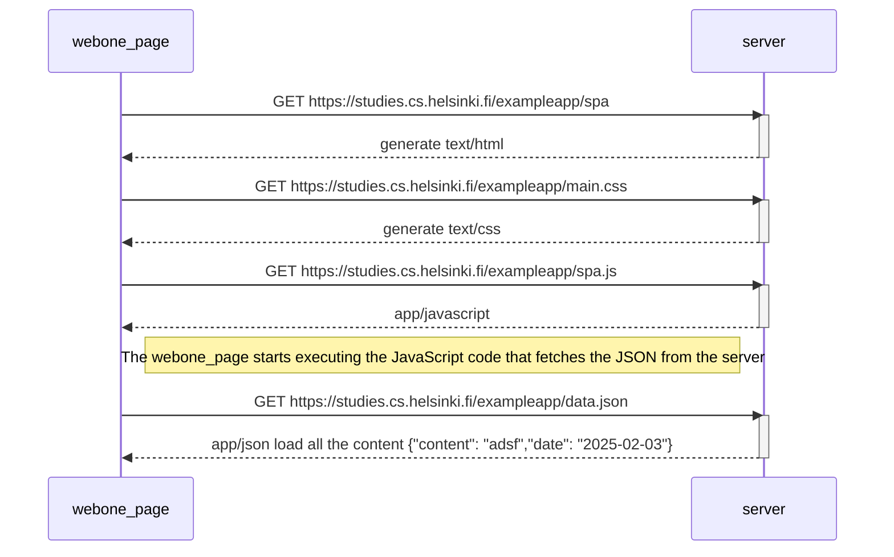

```mermaid

sequenceDiagram
participant webone_page
participant server

  webone_page->>server: GET https://studies.cs.helsinki.fi/exampleapp/spa
  activate server
  server-->>webone_page: generate text/html
  deactivate server

  webone_page->>server: GET https://studies.cs.helsinki.fi/exampleapp/main.css
  activate server
  server-->>webone_page: generate text/css
  deactivate server

  webone_page->>server: GET https://studies.cs.helsinki.fi/exampleapp/spa.js
  activate server
  server-->>webone_page: app/javascript
  deactivate server

  Note right of webone_page: The webone_page starts executing the JavaScript code that fetches the JSON from the server

  webone_page->>server: GET https://studies.cs.helsinki.fi/exampleapp/data.json
  activate server
  server-->>webone_page: app/json load all the content {"content": "adsf","date": "2025-02-03"}

  deactivate server
 

```
