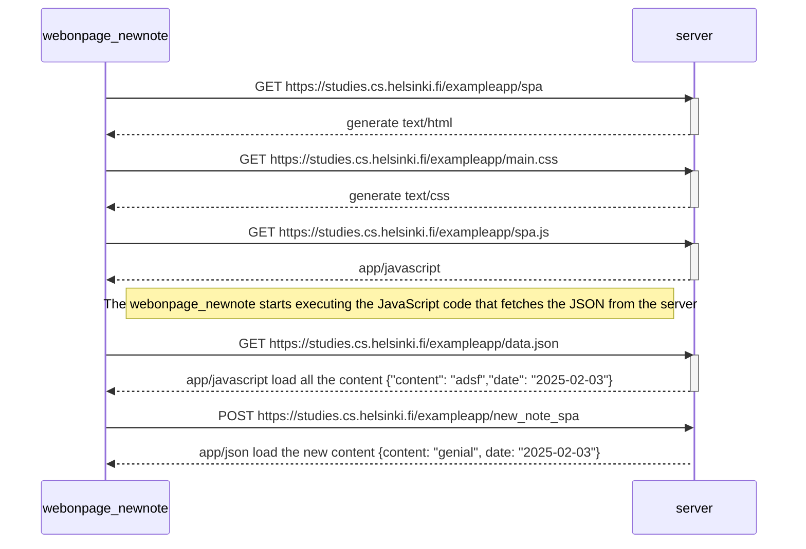

```mermaid

sequenceDiagram
participant webonpage_newnote
participant server

  webonpage_newnote->>server: GET https://studies.cs.helsinki.fi/exampleapp/spa
  activate server
  server-->>webonpage_newnote: generate text/html
  deactivate server

  webonpage_newnote->>server: GET https://studies.cs.helsinki.fi/exampleapp/main.css
  activate server
  server-->>webonpage_newnote: generate text/css
  deactivate server

  webonpage_newnote->>server: GET https://studies.cs.helsinki.fi/exampleapp/spa.js
  activate server
  server-->>webonpage_newnote: app/javascript
  deactivate server

  Note right of webonpage_newnote: The webonpage_newnote starts executing the JavaScript code that fetches the JSON from the server

  webonpage_newnote->>server: GET https://studies.cs.helsinki.fi/exampleapp/data.json
  activate server
  server-->>webonpage_newnote: app/javascript load all the content {"content": "adsf","date": "2025-02-03"}
  deactivate server

  webonpage_newnote->>server: POST https://studies.cs.helsinki.fi/exampleapp/new_note_spa
  activate server
  server-->>webonpage_newnote: app/json load the new content {content: "genial", date: "2025-02-03"}
```
